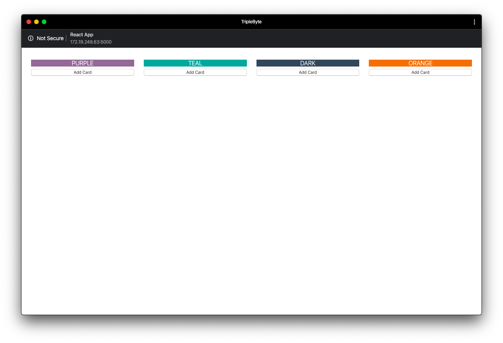
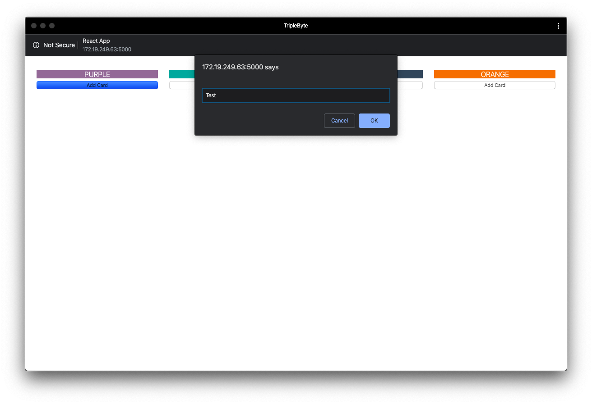
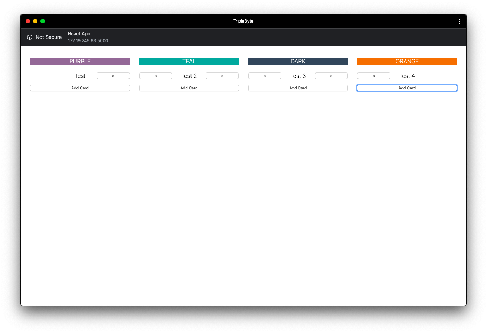
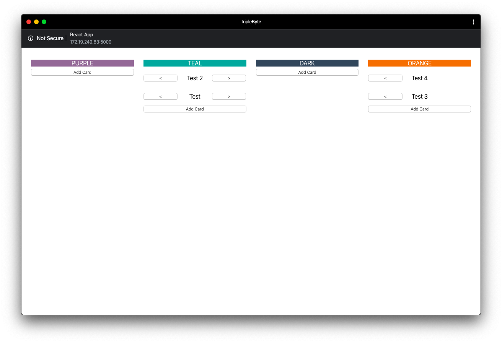

This react app was created during a triplebyte interview

The interviewer allowed 1 hour to complete this app with the following requirements:

  Four columns with specific spacing

  The user can add a card using the add card button

  When add card is cliked the user will be prompted for input using:

  ```
  window.prompt()
  ```

  Left and right controls to move cards from column to column.

Base View: 

Input View: 

Cards View: 

Stacked Cards View: 

Please help improve this project by opening a pull request with a proposed change!
